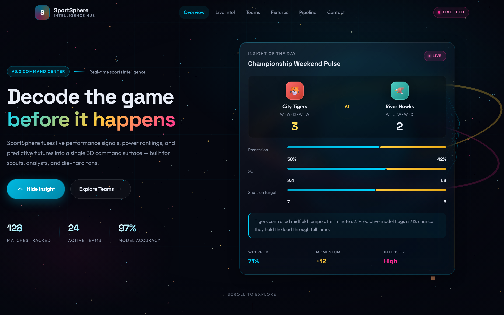
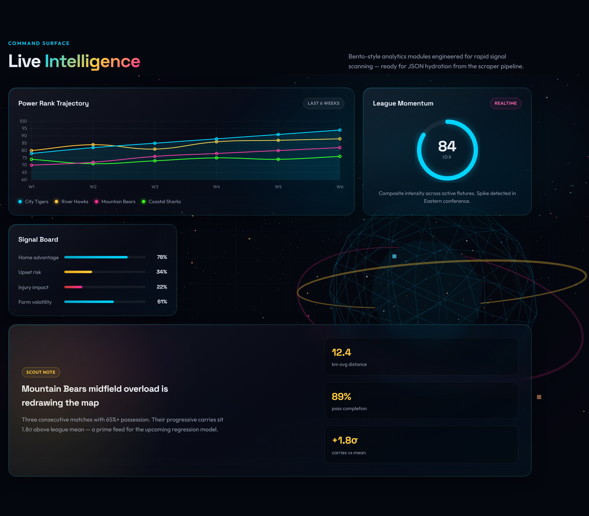
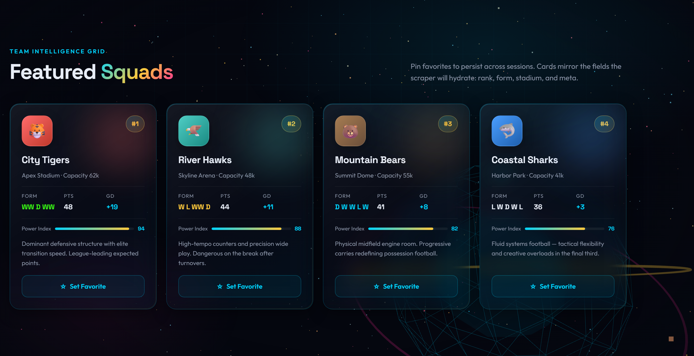
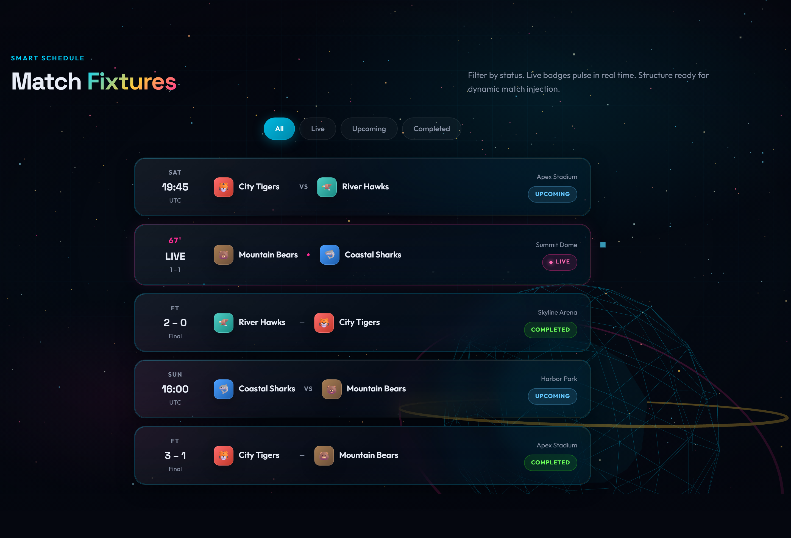
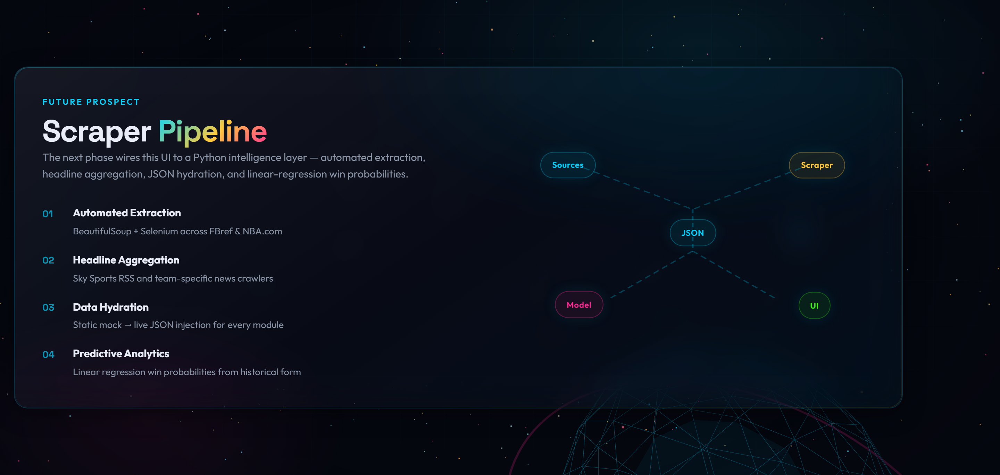

# SportSphere | Real-Time Sports Intelligence & Analytics Pipeline

**SportSphere** is a premium 3D analytics command center that bridges raw web data and actionable sports insights. The platform features an elite glassmorphic interface, WebGL atmosphere, and Lenis-powered smooth scrolling — engineered as the frontend for an automated web scraping pipeline targeting real-world professional sports organizations.

<p align="center">
  
</p>

<p align="center">
  <em>Hero command surface with Three.js atmosphere, live KPIs, and insight controls</em>
</p>

---

## Stack (v3)

| Layer | Choice |
|--------|--------|
| **App** | React 19 + TypeScript (strict) |
| **Build** | Vite 6 |
| **Styling** | Tailwind CSS v4 + ported design system (`src/styles/`) |
| **Smooth scroll** | Lenis |
| **3D atmosphere** | Three.js (imperative scene hook) |
| **Motion** | GSAP + IntersectionObserver reveals |
| **Charts** | Chart.js + react-chartjs-2 |
| **Client state** | React hooks + `localStorage` favorites |

---

## Dashboard Preview

> Fresh captures of the React + TypeScript command surface (`pnpm screenshots`).

### Live Intelligence

Bento-style analytics modules for rapid signal scanning — power-rank trajectories, league momentum radial, signal board, and scout spotlight.

<p align="center">
  
</p>

### Team Intelligence Grid

Featured squads with power index meters, form lines, stadium metadata, and pin-to-favorites (persisted in `localStorage`).

<p align="center">
  
</p>

### Smart Schedule

Fixture tracker with live pulse badges and multi-criteria filtering (All · Live · Upcoming · Completed).

<p align="center">
  
</p>

### Scraper Pipeline (Future Prospect)

Roadmap visualization for the Python intelligence layer — sources → scraper → JSON → model → UI.

<p align="center">
  
</p>

---

## Project Structure

```text
.
├── index.html                 # Vite entry
├── package.json
├── vite.config.ts
├── tsconfig.json
├── src/
│   ├── main.tsx
│   ├── App.tsx
│   ├── components/            # UI by domain (hero, intel, teams, …)
│   ├── data/                  # Typed mock data (JSON-hydration ready)
│   ├── hooks/                 # Lenis, Three, favorites, motion helpers
│   ├── lib/                   # cn, localStorage helpers
│   ├── styles/                # Tailwind entry + design system CSS
│   └── types/                 # Shared TypeScript models
├── docs/screenshots/
├── scripts/capture-screenshots.mjs
├── legacy/                    # Pre-React static snapshot (reference)
└── README.md
```

---

## Getting Started

This project uses **pnpm** (v11+). Corepack / fnm will pick it up via the `packageManager` field.

```bash
pnpm install
pnpm dev
```

Open [http://localhost:5173](http://localhost:5173).

| Script | Description |
|--------|-------------|
| `pnpm dev` | Vite dev server |
| `pnpm build` | Typecheck + production build → `dist/` |
| `pnpm preview` | Preview production build |
| `pnpm typecheck` | TypeScript only |
| `pnpm screenshots` | Capture README shots (server must be running) |

> **pnpm 11 note:** Vite needs `esbuild` postinstall scripts. Those are approved in `pnpm-workspace.yaml` (`allowBuilds.esbuild: true`). If install fails with `ERR_PNPM_IGNORED_BUILDS`, run `pnpm install` again after that file is present (or `pnpm approve-builds esbuild`).

### Regenerating screenshots

```bash
pnpm dev
# in another terminal
pnpm exec playwright install chromium   # first time only
pnpm screenshots
```

Override base URL if needed:

```bash
$env:SCREENSHOT_URL="http://localhost:5173"; pnpm screenshots
```

---

## Dynamic Components

- **Hero Command Surface** — Insight of the Day matchup arena with xG / possession dual-bars, live KPIs, and win-probability footer
- **Live Intelligence Bento** — Power-rank chart, momentum radial meter, signal board, scout spotlight
- **Team Intelligence Grid** — 3D-tilt cards with power index, form, stadium meta, and pin-to-favorites
- **Smart Schedule** — Fixture cards with live pulse badges and multi-criteria filtering
- **Pipeline Teaser** — Future Prospect roadmap visualization (scraper → JSON → model → UI)
- **Ambient UX** — Soft cursor glow, infinite ticker, scroll-linked 3D parallax

Mock content lives under `src/data/` so each module can later load JSON from a scraper pipeline without redesigning the command surface.

---

## Future Prospect: Web Scraping Pipeline

The next phase of development focuses on the **SportSphere Scraper**, a Python-based pipeline designed to automate data collection for specific teams:

- **Automated Extraction:** BeautifulSoup and Selenium against sources like FBref and NBA.com
- **Headline Aggregation:** Team-specific news (e.g. Sky Sports RSS)
- **Data Hydration:** Replace typed mock modules with live JSON
- **Predictive Analytics:** Linear regression win probabilities from historical form

---

## Author

**Krish Kamra**

- GitHub: [@KrishKamra](https://github.com/KrishKamra)
- Project: [SportSphere](https://github.com/KrishKamra/SportSphere)

---

## License

This project is licensed under the **MIT License**. See [`LICENSE`](./LICENSE).

```
MIT License

Copyright (c) 2026 Krish Kamra
```

---

*© 2026 SportSphere. Transforming raw web data into professional sports intelligence.*
